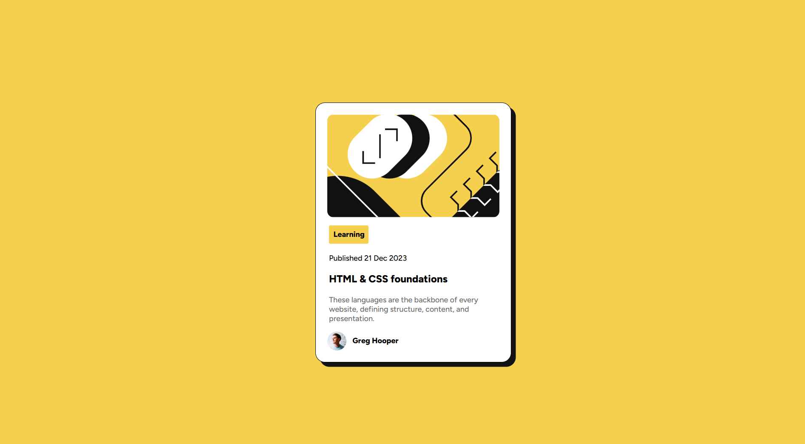

# Frontend Mentor - Blog preview card solution

This is a solution to the [Blog preview card challenge on Frontend Mentor](https://www.frontendmentor.io/challenges/blog-preview-card-ckPaj01IcS). Frontend Mentor challenges help you improve your coding skills by building realistic projects. 

## Table of contents

- [Overview](#overview)
  - [The challenge](#the-challenge)
  - [Screenshot](#screenshot)
  - [Links](#links)
- [My process](#my-process)
  - [Built with](#built-with)
  - [What I learned](#what-i-learned)
  - [Continued development](#continued-development)
  - [AI Collaboration](#ai-collaboration)

**Note: Delete this note and update the table of contents based on what sections you keep.**

## Overview

### The challenge

Users should be able to:

- See hover and focus states for all interactive elements on the page

### Screenshot

### Links

- Solution URL: https://github.com/epicplayfront-dev/Frontend-mentor-blog-preview-challenge
- Live Site URL: https://frontend-mentor-blog-preview-challe.vercel.app/

## My process

### Built with

- Semantic HTML5 markup
- CSS custom properties

### What I learned

I learned the importance of using robust css classes to define styles to prevent unesassary extra work

### Continued development

I would have like to impliment adaptive font sizes without using media querys

### AI Collaboration

Ai helped me find the correct font library import url for the project

